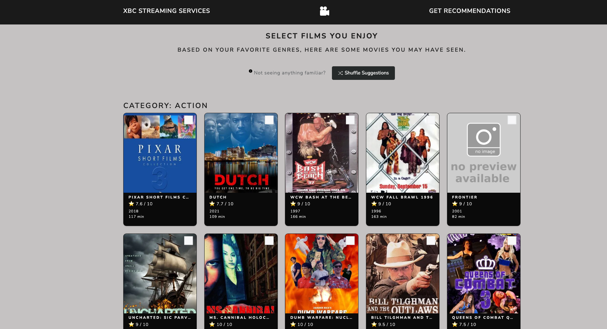

# Movie Recommendation Feature  

### Summary:  
XBC Streaming Services (fictional) is facing customer churn, according to analysis performed by an analytics team. Analysis leads the company to believe the churn stems from company's lack of engagement and personalization for the end user. The company solution to provoke customer interest and increase traffic is to implement a way that users can discover films that exist on the platform that they may not know exists. The development team is tasked with implementing a machine learning solution to solve this problem.  

This recommendation engine is built using Content-Based Filtering with Cosine Similarity. 

### Design:  
The front-end is a Flask application that sends and receives data from Azure Functions. These Azure Functions retrieve data from Azure Blob Storage and processes the data to return relevant information back to the application. The machine learning solution is implemented within one of the Azure Functions using scikit-learn. During development, the Azure Functions run locally via Azure Functions Core Tools V4, although once the product is finished, the Functions will run in the cloud. The end product will be a Docker image, hosted in Azure Web Apps for Containers. This design allows for the use of centralized application configurations, environment variables, lightweight portability, serverless functions that scale with demand, and integration pipelines with GitHub Actions.  

### Data:  
The dataset for this application can be found [here](https://www.kaggle.com/datasets/asaniczka/tmdb-movies-dataset-2023-930k-movies)  

The dataset contains ~1 million entries, so I cleaned and filtered the dataset for my needs. This project is a Capstone project and the dataset contains raunchy material, so I attempted to filter out as much of that material as possible locally before deploying the data to the cloud.  

### POC:  

#### This serves as the existing platform (Imagine something like netflix... but XBC)  
  

#### Select your top three favorite genres  
  

#### You're presented with 15 choices per genre you chose. Select up to 10 total movies  
  
  
  

#### Result of shuffling:  

#### Get your movie recommendations from XBC  
  

#### Click the "More Info" button to read movie descriptions  
  

#### Gain insight into how the recommendations were made + visualizations  
  
  

